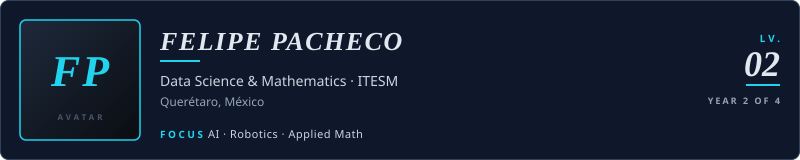
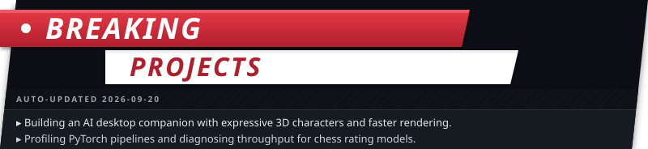
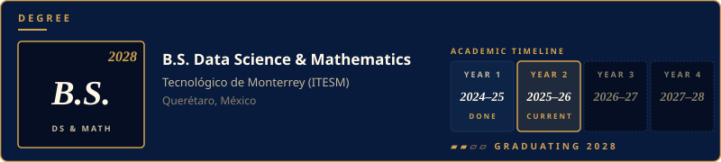
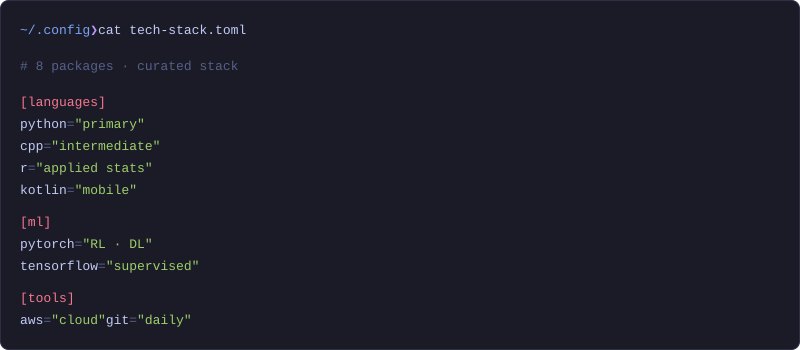

<picture>
  <source media="(prefers-color-scheme: light)" srcset="./assets/card-header-light.svg"/>
  
</picture>

<a href="https://www.linkedin.com/in/felipepachecozamorano">
  <picture>
    <source media="(prefers-color-scheme: light)" srcset="./assets/btn-li-light.svg"/>
    
  </picture>
</a>
&nbsp;
<a href="mailto:felipepachecozamorano@gmail.com">
  <picture>
    <source media="(prefers-color-scheme: light)" srcset="./assets/btn-email-light.svg"/>
    
  </picture>
</a>
&nbsp;
<a href="./resume.pdf">
  <picture>
    <source media="(prefers-color-scheme: light)" srcset="./assets/btn-resume-light.svg"/>
    
  </picture>
</a>

<picture>
  <source media="(prefers-color-scheme: light)" srcset="./assets/bio-light.svg"/>
  
</picture>

<picture>
  <source media="(prefers-color-scheme: light)" srcset="./assets/card-breaking-light.svg"/>
  
</picture>

<picture>
  <source media="(prefers-color-scheme: light)" srcset="./assets/card-education-light.svg"/>
  
</picture>

<picture>
  <source media="(prefers-color-scheme: light)" srcset="./assets/card-tech-light.svg"/>
  
</picture>

 

<a href="https://github.com/FelipeJackFox/minegpt">
  <picture>
    <source media="(prefers-color-scheme: light)" srcset="./assets/card-minegpt-light.svg"/>
    
  </picture>
</a>

<a href="https://github.com/FelipeJackFox/shazam-demo">
  <picture>
    <source media="(prefers-color-scheme: light)" srcset="./assets/card-shazam-light.svg"/>
    
  </picture>
</a>

<a href="https://github.com/FelipeJackFox/rl-snake">
  <picture>
    <source media="(prefers-color-scheme: light)" srcset="./assets/card-rl-snake-light.svg"/>
    
  </picture>
</a>

<a href="https://github.com/FelipeJackFox/PsiNotes">
  <picture>
    <source media="(prefers-color-scheme: light)" srcset="./assets/card-psinotes-light.svg"/>
    
  </picture>
</a>

<a href="https://github.com/FelipeJackFox?tab=repositories">View all repositories  ›</a>

<!-- Plain-text version below for GitHub search, Google, and screen readers. -->

Profile in plain text (search & accessibility)

**Felipe Pacheco Zamorano** — Data Science & Mathematics student at Tecnológico de Monterrey (ITESM), Querétaro, Mexico. Focus areas: artificial intelligence, robotics, and applied mathematics.

**Now** — Building reinforcement learning and audio-processing demos. Designing tooling for agentic dev workflows (Claude Code + MCP).

**Education** — B.S. Data Science & Mathematics, ITESM, expected 2028.

**Tech stack** — Python, C++, R, Kotlin, PyTorch, TensorFlow, AWS, Git.

**Featured projects**
- [rl-snake](https://github.com/FelipeJackFox/rl-snake) — Reinforcement learning agent that learns to play Snake (Python).
- [shazam-demo](https://github.com/FelipeJackFox/shazam-demo) — Audio fingerprinting and song recognition, Shazam-style demo (Python).
- [NC-Syndrome](https://github.com/FelipeJackFox/NC-Syndrome) — Statistical analysis project in R.
- [PsiNotes](https://github.com/FelipeJackFox/PsiNotes) — Native Android notes app (Kotlin).

**Contact** — [LinkedIn](https://www.linkedin.com/in/felipepachecozamorano) · [Email](mailto:felipepachecozamorano@gmail.com)

