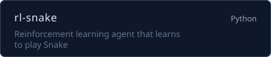
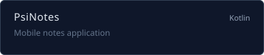
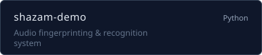
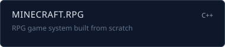

  

 

  
  &nbsp;&nbsp;
  

 

Engineering student in **Data Science & Mathematics** at Tecnologico de Monterrey.
Focused on **artificial intelligence**, **robotics**, and systems that learn from the real world.
When I'm not coding, I'm probably drawing or tinkering with a new side project.

 

### Tech Stack

  

 

### Projects

  
  &nbsp;
  

  
  &nbsp;
  

