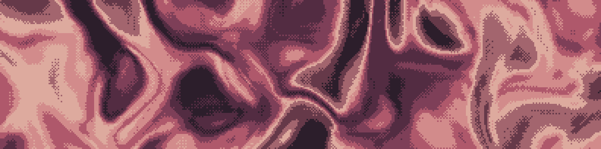
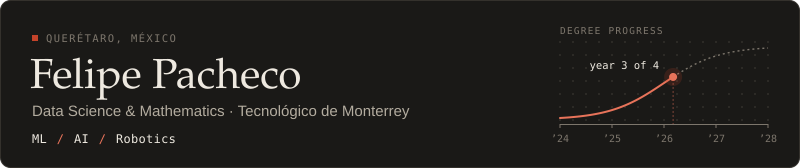
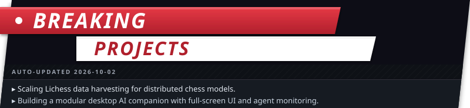
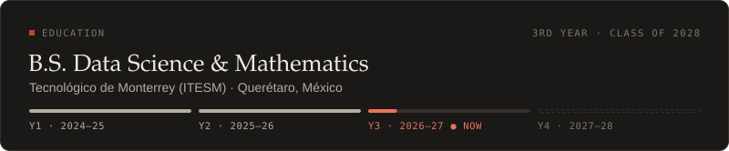
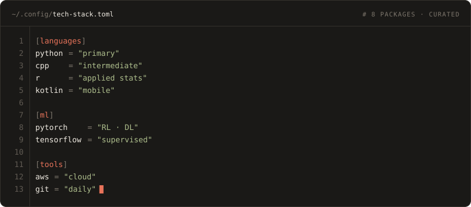
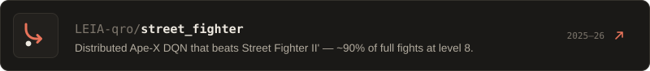
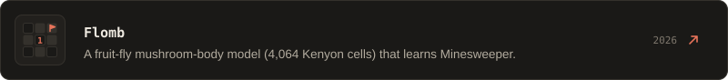
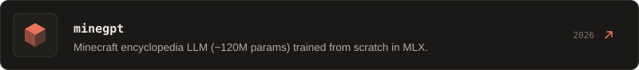
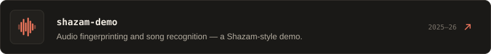

<picture>
  <source media="(prefers-color-scheme: light)" srcset="./assets/banner-light.png"/>
  
</picture>

<picture>
  <source media="(prefers-color-scheme: light)" srcset="./assets/card-header-light.svg"/>
  
</picture>

<a href="https://www.linkedin.com/in/felipepachecozamorano"><picture><source media="(prefers-color-scheme: light)" srcset="./assets/btn-li-light.svg"/></picture></a>
&nbsp;
<a href="mailto:felipepachecozamorano@gmail.com"><picture><source media="(prefers-color-scheme: light)" srcset="./assets/btn-email-light.svg"/></picture></a>
&nbsp;
<a href="./resume.pdf"><picture><source media="(prefers-color-scheme: light)" srcset="./assets/btn-resume-light.svg"/></picture></a>

<picture>
  <source media="(prefers-color-scheme: light)" srcset="./assets/card-breaking-light.svg"/>
  
</picture>

<picture>
  <source media="(prefers-color-scheme: light)" srcset="./assets/card-education-light.svg"/>
  
</picture>

<picture>
  <source media="(prefers-color-scheme: light)" srcset="./assets/card-tech-light.svg"/>
  
</picture>

 

<a href="https://github.com/LEIA-qro/street_fighter"><picture><source media="(prefers-color-scheme: light)" srcset="./assets/card-street-fighter-light.svg"/></picture></a>

<picture>
  <source media="(prefers-color-scheme: light)" srcset="./assets/card-flomb-light.svg"/>
  
</picture>

<a href="https://github.com/FelipeJackFox/minegpt"><picture><source media="(prefers-color-scheme: light)" srcset="./assets/card-minegpt-light.svg"/></picture></a>

<a href="https://github.com/FelipeJackFox/shazam-demo"><picture><source media="(prefers-color-scheme: light)" srcset="./assets/card-shazam-light.svg"/></picture></a>

<a href="https://github.com/FelipeJackFox?tab=repositories">View all repositories  ›</a>

<!-- Plain-text version below for GitHub search, Google, and screen readers. -->

Profile in plain text (search & accessibility)

**Felipe Pacheco Zamorano** — Data Science & Mathematics student at Tecnológico de Monterrey (ITESM), Querétaro, Mexico. Focus areas: machine learning, artificial intelligence, and robotics.

**Now** — Building reinforcement learning and audio-processing demos. Designing tooling for agentic dev workflows (Claude Code + MCP).

**Education** — B.S. Data Science & Mathematics, ITESM, expected 2028.

**Tech stack** — Python, C++, R, Kotlin, PyTorch, TensorFlow, AWS, Git.

**Featured projects**
- [street_fighter](https://github.com/LEIA-qro/street_fighter) — Distributed Ape-X DQN for Street Fighter II', built at the LEIA lab (Python).
- Flomb — A fruit-fly mushroom-body model (4,064 Kenyon cells) that learns Minesweeper (Python).
- [minegpt](https://github.com/FelipeJackFox/minegpt) — Minecraft encyclopedia LLM (~120M params) trained from scratch in MLX (Python).
- [shazam-demo](https://github.com/FelipeJackFox/shazam-demo) — Audio fingerprinting and song recognition, Shazam-style demo (Python).

**Contact** — [LinkedIn](https://www.linkedin.com/in/felipepachecozamorano) · [Email](mailto:felipepachecozamorano@gmail.com)

